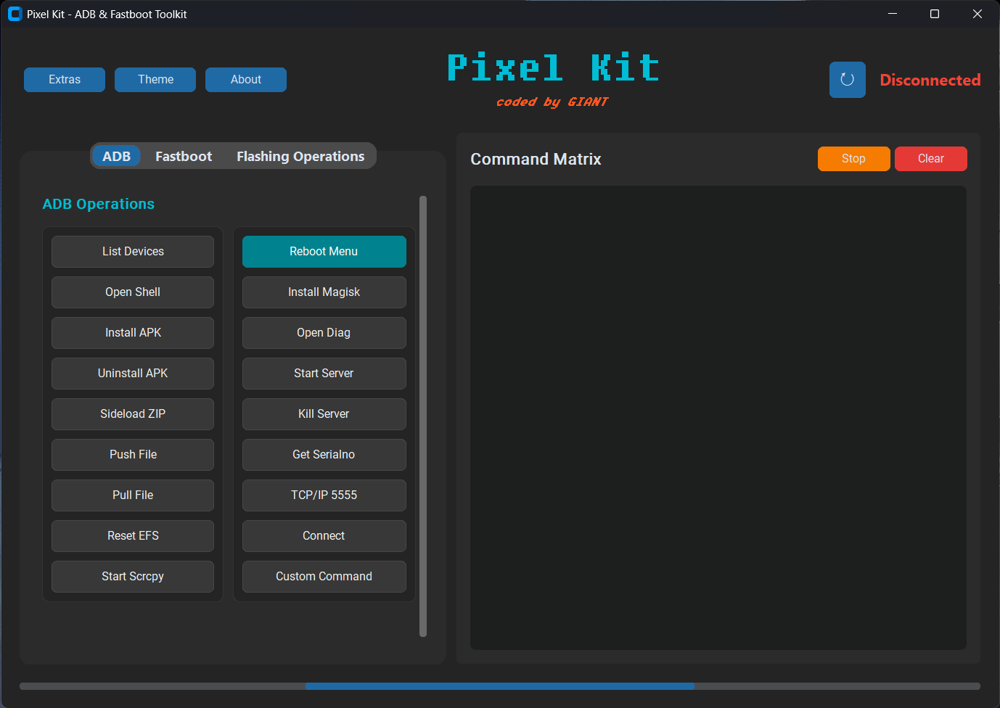
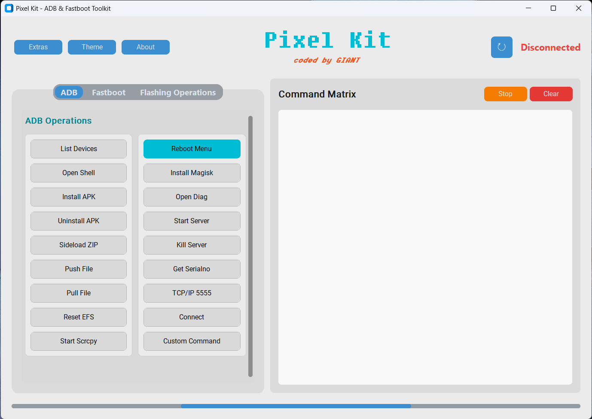
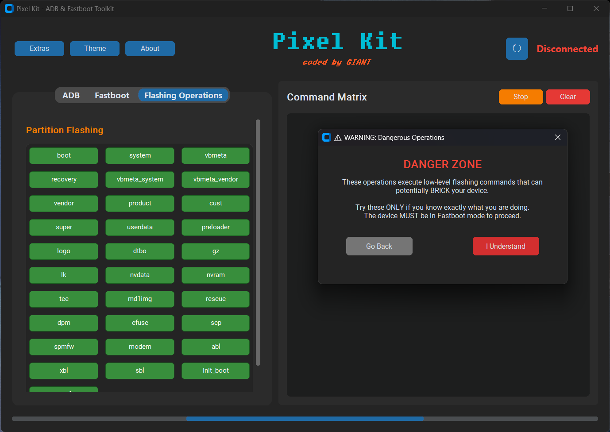
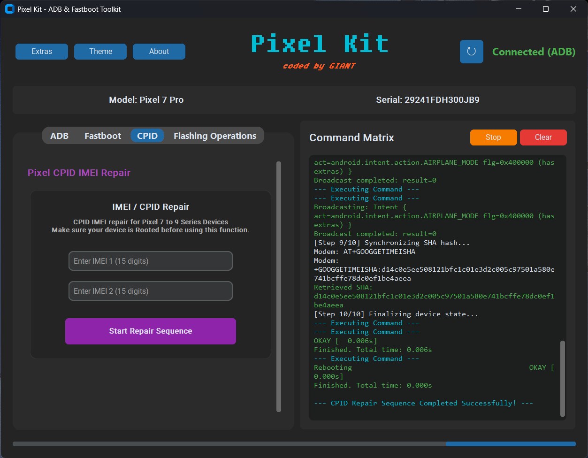

<div align="center">



[](https://www.python.org/)
[](https://github.com/TomSchimansky/CustomTkinter)
[](https://github.com/not-GIANT/Pixel-Kit/releases)
[](https://opensource.org/licenses/MIT)
[](https://github.com/not-GIANT/Pixel-Kit/releases/tag/latest)

*A modern GUI toolkit for ADB & Fastboot — complex Android operations, one click away.*

[**⬇ Download .exe**](https://github.com/not-GIANT/Pixel-Kit/releases/tag/latest) · [**📖 Installation**](#-installation) · [**📸 Screenshots**](#-screenshots)

</div>

---

## What Is This?

Pixel Kit puts a clean graphical interface on top of ADB and Fastboot — the two command-line tools Android developers and enthusiasts use for everything from sideloading APKs to flashing firmware partitions. Instead of memorizing syntax and typing commands by hand, you click a button.

It covers device management, partition flashing (30+ partitions), bootloader control, file transfer, app management, screen mirroring via Scrcpy, and advanced tools like EFS reset and Qualcomm Diag Mode — all with live device polling, threaded output, and a console you can stop mid-operation.

> **Designed for Android enthusiasts and developers who want power without the terminal friction.**

---

## ✦ Features

### 📱 ADB Operations

| Feature | Description |
|---|---|
| **File Transfer** | Push and pull files with dynamic path support |
| **App Management** | One-click APK install, uninstall, and sideload |
| **Power Menu** | Reboot to System, Bootloader, Recovery, or EDL mode |
| **Screen Mirroring** | Integrated Scrcpy support for high-performance device mirroring |
| **Advanced Tools** | Qualcomm Diag Mode enabler · EFS partition reset *(root required)* |

### ⚡ Fastboot Operations

| Feature | Description |
|---|---|
| **Bootloader Control** | Lock/unlock with support for both Modern/Pixel and Legacy devices |
| **Maintenance** | Erase Cache, wipe FRP, or perform a full user data wipe |
| **Slot Management** | Switch active A/B slots and pull detailed device info |
| **Live Boot** | Boot temporarily from a `.img` file without flashing |

### 🔧 Partition Flashing

- Dedicated support for **30+ Android partitions** — `boot`, `system`, `recovery`, `vbmeta`, `vendor`, `dtbo`, and more
- Pre-configured safety checks to prevent syntax errors during flashing operations

### 🛠️ CPID IMEI Repair

- Dedicated repair interface for **Pixel 7, 8, and 9 series** devices
- Fully automated 10-step sequence — partition pulling, binary patching, and modem synchronization
- Mandatory legal warning and automated root-access check before any operation begins

### 🎨 UI & UX

- **Themes** — Light, Dark, and System-adaptive modes
- **Live Device Polling** — Real-time connection status indicator
- **Threaded Console** — Command output streams live; stop any process mid-run

---

## 📸 Screenshots

<div align="center">

| Dark Mode | Light Mode |
|:---:|:---:|
|  |  |

| Partition Flashing | CPID IMEI Repair |
|:---:|:---:|
|  |  |

</div>

---

## ⬇ Installation

### Option A — Standalone Executable *(Recommended)*

No Python or dependencies needed.

1. Go to [**Releases**](https://github.com/not-GIANT/Pixel-Kit/releases/tag/latest)
2. Download the latest standalone EXE fil
3. Run `Pixel Kit.exe` and thats it. No need to install anything. 

### Option B — Run from Source

**Prerequisites:** Python 3.10+

```bash
# Clone the repository
git clone https://github.com/not-GIANT/Pixel-Kit.git
cd Pixel-Kit

# Install dependencies
pip install customtkinter pillow

# Launch
python "Pixel Kit.py"
```

> ADB and Fastboot binaries are included in the `platform-tools/` folder — no separate SDK download required.

---

## 🛠️ Tech Stack

| Layer | Technology |
|---|---|
| **Language** | Python 3.10+ |
| **GUI Framework** | CustomTkinter |
| **Android Bridge** | ADB & Fastboot (bundled platform-tools) |
| **Screen Mirror** | Scrcpy |
| **Packaging** | PyInstaller |

---

## 🗂️ Project Structure

```
Pixel-Kit/
├── Pixel Kit.py        ← Main application — all UI, ADB, Fastboot logic
├── platform-tools/     ← Bundled ADB & Fastboot binaries
├── Icon.png            ← Application icon
└── README.md
```

---

## ⚠️ Disclaimer

Pixel Kit performs low-level operations on your Android device. Unlocking bootloaders, flashing partitions, and wiping EFS data can permanently damage or brick your device if used incorrectly.

**Use this tool at your own risk.** Always back up your data before proceeding. The developer is not responsible for data loss, device damage, or warranty voidance.

---

## 🗺️ Roadmap

- [ ] Linux support
- [ ] Device profile presets (save common flash configs)
- [ ] Batch flashing — flash multiple partitions in sequence from a manifest
- [ ] OTA package sideload automation
- [ ] Built-in ADB log viewer / logcat tab

---

<div align="center">

---

*Developed with ❤️ by [**GIANT**](https://github.com/not-GIANT)*

*If it saved you a headache, drop a ⭐*

</div>
