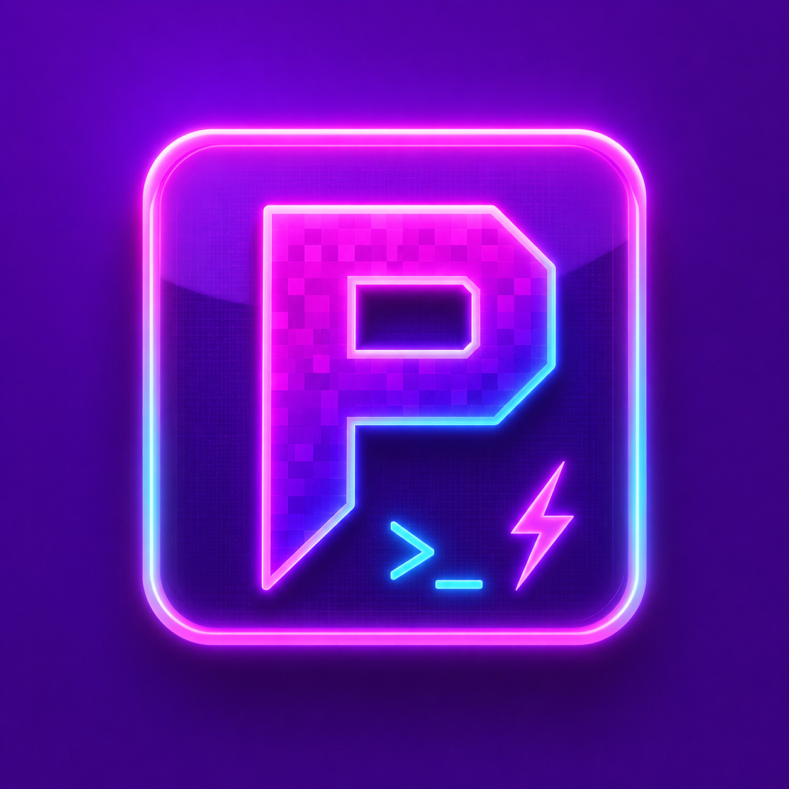

<p align="center">
  
</p>

<h1 align="center">Pixel Kit</h1>

<p align="center">
  <a href="https://www.python.org/">
    
  </a>
  <a href="https://github.com/TomSchimansky/CustomTkinter">
    
  </a>
  <a href="https://www.microsoft.com/windows">
    
  </a>
</p>

<p align="center">
  <strong>Pixel Kit</strong> is a modern, streamlined ADB & Fastboot toolkit designed for Android enthusiasts and developers. It provides a powerful graphical interface to execute complex terminal commands with a single click, ensuring safety and efficiency during device maintenance or customization.
</p>

---

## ✨ Features

### 📱 ADB Operations
*   **File Management:** Seamlessly push or pull files with dynamic path support.
*   **App Management:** One-click APK installation, uninstallation, and sideloading.
*   **Power Menu:** Quick reboot to System, Bootloader, Recovery, or EDL mode.
*   **Screen Mirroring:** Integrated **Scrcpy** support for high-performance device mirroring.
*   **Advanced Tools:** Qualcomm Diag Mode enabler and EFS partition resetting (Root required).

### ⚡ Fastboot Operations
*   **Bootloader Control:** Easy Unlocking and Locking (support for Modern/Pixel and Legacy devices).
*   **Maintenance:** Erase Cache, FRP, or perform a full User Data Wipe.
*   **Slot Management:** Switch active A/B slots and retrieve exhaustive device info.
*   **Live Boot:** Temporarily boot from `.img` files without flashing.

### 🛠️ Flashing Arsenal
*   Dedicated support for **30+ specific Android partitions** (boot, system, recovery, vbmeta, etc.).
*   Pre-configured safety checks to prevent syntax errors during flashing.

### 🎨 Modern UX/UI
*   **Adaptive Themes:** Support for Light, Dark, and System modes.
*   **Real-time Tracking:** Live device connection polling and status indicator.
*   **Command Matrix:** Threaded console output with "Stop" functionality for active processes.

---

## 🚀 Installation & Usage

### Option 1: Standalone Executable (Recommended)
1.  Navigate to the `dist/Pixel Kit/` folder.
2.  Launch `Pixel Kit.exe`.
3.  *Note: This version is optimized for speed and includes all required drivers and tools.*

### Option 2: Running from Source
1.  **Clone the repository:**
    ```bash
    git clone https://github.com/not-GIANT/Pixel-Kit.git
    cd Pixel-Kit
    ```
2.  **Install dependencies:**
    ```bash
    pip install customtkinter pillow
    ```
3.  **Run the application:**
    ```bash
    python "Pixel Kit.py"
    ```

---

## 📸 Screenshots

*(Add your screenshots here to make the README even more professional!)*

---

## ⚠️ Disclaimer
**Pixel Kit** performs low-level operations on your Android device. Modifying partitions, unlocking bootloaders, or wiping EFS data can potentially brick your device. 
**Use this tool at your own risk.** The developers are not responsible for any data loss or hardware damage.

---

## 👨‍💻 Author
**Coded with ❤️ by GIANT**

If you find this tool useful, feel free to ⭐ the repository!
