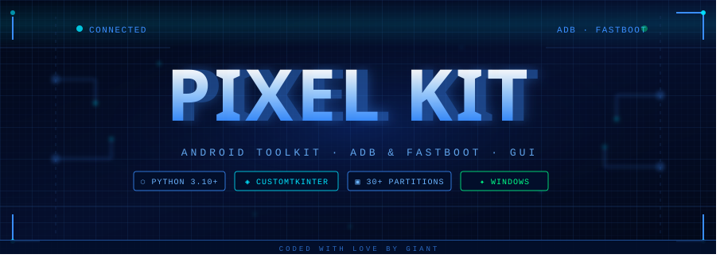

<div align="center">



[](https://www.python.org/)
[](https://doc.qt.io/qtforpython-6/)
[](https://m3.material.io/)
[](https://github.com/not-GIANT/Pixel-Kit/releases)
[](https://opensource.org/licenses/MIT)

*A modern GUI toolkit for ADB & Fastboot. Complex Android operations, one click away.*

[**⬇ Download .exe**](https://github.com/not-GIANT/Pixel-Kit/releases/tag/latest) · [**📖 Installation**](#-installation) · [**📸 Screenshots**](#-screenshots)

</div>

---

## What Is This?

**Pixel Kit** puts a clean, hardware-accelerated graphical interface on top of **ADB** and **Fastboot** — the two command-line tools Android developers and enthusiasts use for everything from sideloading APKs to flashing firmware partitions.

Version **3.1** is a ground-up rewrite that replaces the previous CustomTkinter UI with a native **Qt 6 / PySide6** interface powered by **Material 3** design. The codebase is now split into a reusable service layer (`pixelkit/`) and a dedicated Qt UI layer (`pixelkit_qt/`), making the app easier to maintain, extend, and theme.

> **Designed for Android enthusiasts and developers who want power without the terminal friction.**

---

## ✦ Features

### 📱 ADB Operations

| Feature | Description |
|---|---|
| **Device Management** | Live device polling with connection status and device card details |
| **File Transfer** | Push and pull files with dynamic path support |
| **App Management** | One-click APK install, uninstall, and sideload |
| **Power Menu** | Reboot to System, Bootloader, Recovery, or EDL mode |
| **Screen Mirroring** | Integrated Scrcpy support for high-performance device mirroring |
| **Advanced Tools** | Qualcomm Diag Mode enabler · EFS partition reset *(root required)* |

### ⚡ Fastboot Operations

| Feature | Description |
|---|---|
| **Bootloader Control** | Lock/unlock with support for both Modern/Pixel and Legacy devices |
| **Maintenance** | Erase Cache, wipe FRP, or perform a full user data wipe |
| **Slot Management** | Switch active A/B slots and pull detailed device info |
| **Live Boot** | Boot temporarily from a `.img` file without flashing |

### 🔧 Partition Flashing

- Dedicated support for **30+ Android partitions** — `boot`, `system`, `recovery`, `vbmeta`, `vendor`, `dtbo`, and more.
- Pre-configured safety checks to prevent syntax errors during flashing operations.

### 🛠️ CPID IMEI Repair

- Dedicated repair interface for **Pixel 7, 8, and 9 series** devices.
- Fully automated multi-step sequence: partition pulling, binary patching, and modem synchronization.
- Mandatory legal warning and automated root-access check before any operation begins.

### 🎨 UI & UX

- **Material 3 Design** — Dynamic color schemes and consistent component styling.
- **Light / Dark / System Themes** — Adaptive theme engine.
- **Live Device Polling** — Real-time connection status indicator.
- **Threaded Console** — Command output streams live; stop any process mid-run.
- **Navigable Rail** — Quick access to ADB, Fastboot, Flashing, and CPID views.

---

## 📸 Screenshots

*(Screenshots will be added to the `screenshots/` folder as the UI stabilizes.)*

---

## ⬇ Installation

### Option A — Standalone Executable *(Recommended)*

No Python or dependencies needed.

1. Go to [**Releases**](https://github.com/not-GIANT/Pixel-Kit/releases/tag/latest)
2. Download the latest standalone EXE file
3. Run `Pixel Kit.exe` — no installation required

> Built with `pyinstaller "Pixel Kit.spec"`.

### Option B — Run from Source

**Prerequisites:** Python 3.10+

```bash
# Clone the repository
git clone https://github.com/not-GIANT/Pixel-Kit.git
cd Pixel-Kit

# Install dependencies
pip install PySide6 material_color_utilities

# Launch
python run.py
```

> ADB and Fastboot binaries are included in `resources/platform-tools/`. No separate SDK download is required.

---

## 🛠️ Tech Stack

| Layer | Technology |
|---|---|
| **Language** | Python 3.10+ |
| **GUI Framework** | Qt 6 via PySide6 |
| **Design System** | Material 3 |
| **Color Engine** | `material_color_utilities` (HCT / dynamic color) |
| **Android Bridge** | ADB & Fastboot (bundled in `resources/platform-tools/`) |
| **Screen Mirror** | Scrcpy |
| **Packaging** | PyInstaller |

---

## 🗂️ Project Structure

```
Pixel-Kit/
├── run.py                      ← Launcher script
├── pixelkit/                   ← Core services layer
│   ├── config.py
│   ├── logger.py
│   ├── models/
│   │   └── device.py
│   └── services/
│       ├── command_executor.py
│       ├── cpid_service.py
│       ├── device_monitor.py
│       └── pixel10_service.py
├── pixelkit_qt/                ← Qt / Material 3 UI layer
│   ├── app.py
│   ├── bridge.py
│   ├── theme/                  ← Theme engine, tokens, icons, stylesheets
│   ├── views/                  ← ADB, Fastboot, Flashing, CPID views
│   └── widgets/                ← Reusable M3 widgets
├── resources/                  ← Runtime assets
│   ├── platform-tools/         ← Bundled ADB, Fastboot, Scrcpy
│   ├── models/                 ← CPID / device models
│   ├── cpid_logic.py
│   ├── di.py
│   ├── pixel_10.py
│   ├── lexipwn / lexipwn-cli   ← CPID tooling
│   ├── devinfo.img
│   └── modified_devinfo.img
├── Pixel Kit.spec              ← PyInstaller specification
├── icon.ico / icon.png
└── README.md
```

---

## ⚠️ Disclaimer

Pixel Kit performs low-level operations on your Android device. Unlocking bootloaders, flashing partitions, and wiping EFS data can permanently damage or brick your device if used incorrectly.

**Use this tool at your own risk.** Always back up your data before proceeding. The developer is not responsible for data loss, device damage, or warranty voidance.

---

## 🗺️ Roadmap

- [ ] Linux support
- [ ] Device profile presets (save common flash configs)
- [ ] Batch flashing — flash multiple partitions in sequence from a manifest
- [ ] OTA package sideload automation
- [ ] Built-in ADB log viewer / logcat tab

---

<div align="center">

*Developed with ❤️ by [**GIANT**](https://github.com/not-GIANT)*

*If it saved you a headache, drop a ⭐*

</div>
