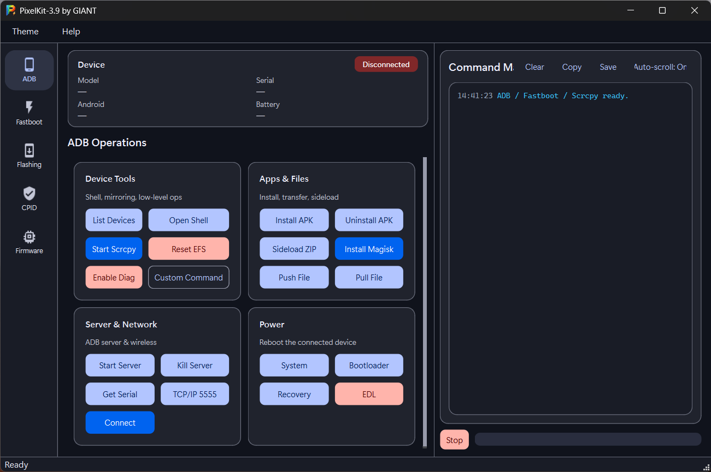
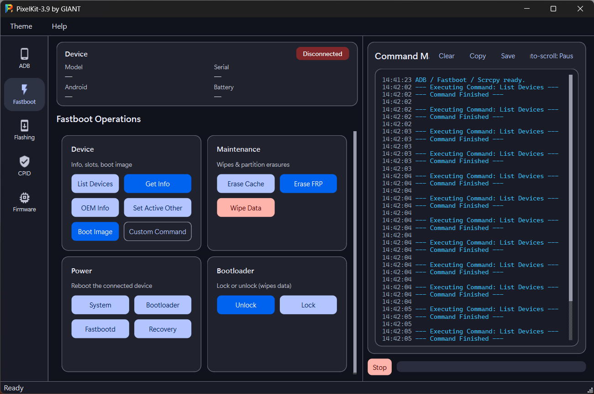
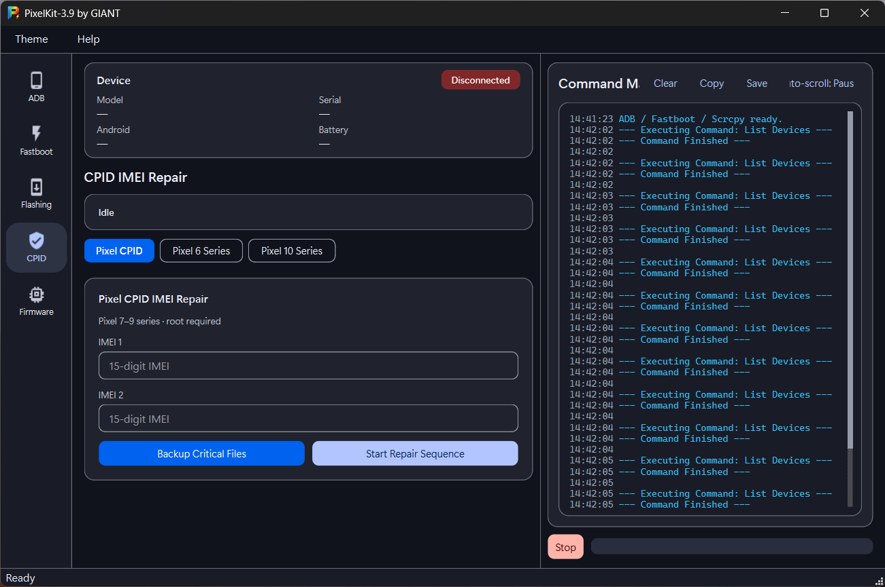
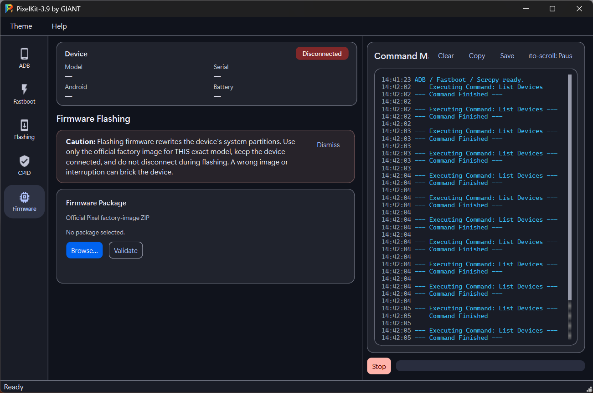
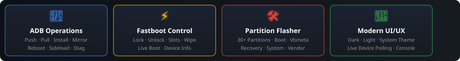
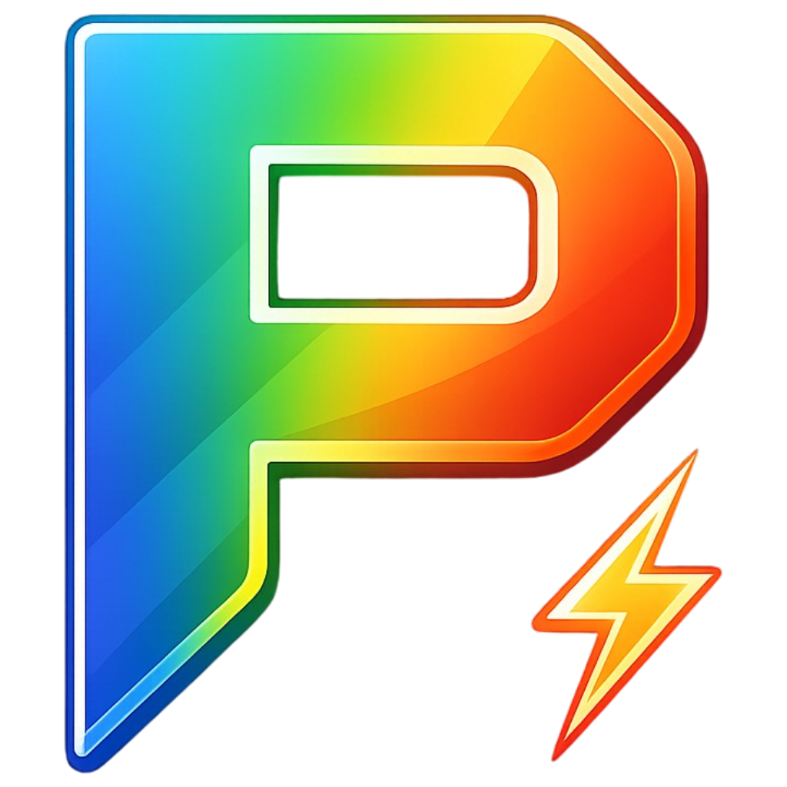

<p align="center">
  
</p>

<p align="center">
  <a href="https://www.python.org/downloads/">
    
  </a>
  <a href="https://github.com/TomSchimansky/CustomTkinter">
    
  </a>
  
  <a href="https://github.com/not-GIANT/Pixel-Kit/releases">
    
  </a>
  
  
</p>

<p align="center">
  <b>A powerful, modern GUI toolkit for Google Pixel devices — ADB, Fastboot, flashing, and more, all in one clean interface.</b>
</p>

<br/>

---

## 📸 Screenshots

<p align="center">
  
  &nbsp;
  
</p>

<p align="center">
  
  &nbsp;
  
</p>

<br/>

<p align="center">
  
</p>

## ✨ Features

<p align="center">
  
</p>

<br/>

### 📱 ADB Operations

| Feature | Description |
|---|---|
| 📂 **File Push / Pull** | Transfer files to and from your device with dynamic path support |
| 📦 **App Management** | Install, uninstall, and sideload APKs with a single click |
| 🔄 **Power Menu** | Reboot to System, Bootloader, Recovery, or EDL mode instantly |
| 🖥️ **Screen Mirroring** | High-performance device mirroring via integrated **Scrcpy** support |
| 🔧 **Advanced Tools** | Qualcomm Diag Mode enabler and EFS partition reset *(Root required)* |

### ⚡ Fastboot Operations

| Feature | Description |
|---|---|
| 🔓 **Bootloader Control** | Easy unlock/lock for both Modern Pixel and Legacy devices |
| 🧹 **Maintenance** | Erase Cache, FRP, or perform a full User Data wipe |
| 🔀 **Slot Management** | Switch active A/B slots and retrieve exhaustive device info |
| 💿 **Live Boot** | Temporarily boot a `.img` file without flashing it permanently |

### 🛠️ Partition Flashing Arsenal

Support for **30+ specific Android partitions**, including:

```
boot          •  recovery      •  vbmeta        •  system
vendor        •  product       •  dtbo           •  super
modem         •  bluetooth     •  radio          •  tz
... and many more
```

Pre-configured safety checks prevent syntax errors during critical flash operations.

### 🎨 Modern UI/UX

- **Adaptive Themes** — Light, Dark, and System-synced modes
- **Real-time Device Polling** — Live connection status indicator
- **Threaded Console** — Non-blocking command output with a **Stop** button for active processes
- **Windows 11 Native Feel** — Clean, compact layout optimized for the Windows experience

<p align="center">
  
</p>

---

## 📱 Supported Devices

<p align="center">

| Device | Model | Android | Status |
|--------|-------|---------|--------|
| Pixel 6 | `oriole` | 12 → 16 | ✅ Supported |
| Pixel 6 Pro | `raven` | 12 → 16 | ✅ Supported |
| Pixel 6a | `bluejay` | 12 → 16 | ✅ Supported |
| Pixel 7 | `panther` | 13 → 16 | ✅ Supported |
| Pixel 7 Pro | `cheetah` | 13 → 16 | ✅ Supported |
| Pixel 7a | `lynx` | 13 → 16 | ✅ Supported |
| Pixel 8 | `shiba` | 14 → 16 | ✅ Supported |
| Pixel 8 Pro | `husky` | 14 → 16 | ✅ Supported |
| Pixel 8a | `akita` | 14 → 16 | ✅ Supported |
| Pixel 9 | `tokay` | 16 | ✅ Supported |
| Pixel 9 Pro | `caiman` | 16 | ✅ Supported |
| Pixel 9 Pro XL | `komodo` | 16 | ✅ Supported |
| Pixel 9 Pro Fold | `comet` | 16 | ✅ Supported |
| Pixel 9a | `manta` | 16 | ✅ Supported |
| Pixel 10 Pro | `blazer` | 16 | ✅ Supported |
| Pixel 10 Pro XL | `mustang` | 16 | ✅ Supported |
| Pixel 10 | `frankel` | 16 | ✅ Supported |

</p>

> [!NOTE]
> Android 16 QPR1 introduced new IMEI/EFS partition restrictions. Some low-level operations may require additional steps on devices running Android 16+.

<p align="center">
  
</p>

---

## 🚀 Installation

### Option 1 — Standalone Executable *(Recommended)*

> No Python required. Just download and run.

1. Go to the [**Releases**](https://github.com/not-GIANT/Pixel-Kit/releases) page
2. Download the latest `Pixel.Kit.zip`
3. Extract and launch `Pixel Kit.exe`

> **Note:** ADB and Fastboot platform tools are bundled — no setup needed.

---

### Option 2 — Run from Source

**Prerequisites:** Python 3.10+, Git

```bash
# 1. Clone the repository
git clone https://github.com/not-GIANT/Pixel-Kit.git
cd Pixel-Kit

# 2. Install dependencies
pip install PyQt6 pillow

# 3. Launch
python "Pixel Kit.py"
```

<p align="center">
  
</p>

---

## ⚙️ Requirements

| Requirement | Details |
|---|---|
| **OS** | Windows 10 / 11 (64-bit) |
| **Python** | 3.10 or newer *(source only)* |
| **USB Drivers** | [Google USB Driver](https://developer.android.com/studio/run/win-usb) |
| **ADB / Fastboot** | Bundled in `platform-tools/` |
| **USB Debugging** | Must be enabled on the device |

<p align="center">
  
</p>

---

## ⚠️ Disclaimer

> [!WARNING]
> **Pixel Kit performs low-level operations on your Android device.**
>
> Modifying partitions, unlocking bootloaders, or wiping EFS data can **permanently brick** your device or void your warranty. Always back up your data before proceeding. The author is not responsible for any data loss, hardware damage, or device failure resulting from use of this tool.
>
> **Use at your own risk.**

<p align="center">
  
</p>

---

<p align="center">
  <br/>
  
  <br/><br/>
  <b>Coded with ❤️ by <a href="https://github.com/not-GIANT">GIANT</a></b>
  <br/>
  <sub>If Pixel Kit saved you time, drop a ⭐ — it means a lot!</sub>
  <br/><br/>
  <a href="https://github.com/not-GIANT/Pixel-Kit/issues">🐛 Report Bug</a>
  &nbsp;•&nbsp;
  <a href="https://github.com/not-GIANT/Pixel-Kit/issues">💡 Request Feature</a>
  &nbsp;•&nbsp;
  <a href="https://github.com/not-GIANT/Pixel-Kit/releases">📦 Download</a>
  <br/><br/>
  
</p>
